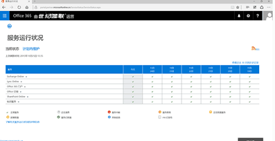

   

      

         

            

               

                  <ul bi:type="list" class="slides">
                     <li id="slide-1" bi:index="0" selectBi="">
                        

                           

                              <a href="" bi:track="False" bi:titleflag="t1" bi:index="0">
                                 

                                    

                                    <noscript></noscript>
                                 

                              </a>
                           

                           

                              

                                 

                                    <ul bi:type="list" class="headerCaption subpageHeaderCaption">
                                       <li class="box-title">
                                          <h3 class="box-title" bi:type="title" bi:title="t1" style="color: #FFFFFF;">Office 365</h3>
                                       </li>
                                       <li class="box-actions box-description"></li>
                                    </ul>
                                 

                              

                           

                        

                     </li>
                  </ul>
                  

                     

                  

                  
<button class="prev">Previous</button><button class="next">Next</button>

                  

                     
<button id="pauseButton" class="pause_button">Pause</button>

                     
<button id="playButton" class="play_button">Play</button>

                  

               

            

         

         

            
<a target="_self" class="mscom-link" href="../default.html">Trust Center</a> // 
               <a target="_self" class="mscom-link" href="../cloudservices/default.html">Cloud Services</a> // Office 365
            

         

         

                

                    
Office 365 operated by 21Vianet is a separate instance of Microsoft’s Office 365 cloud services located in mainland China and independently operated and sold by <a target="_self" class="mscom-link" href="http://www.ch.21vianet.com/">Shanghai Blue Cloud Technology Co., Ltd. (“21Vianet”)</a>, a wholly owned subsidiary of Beijing 21Vianet Broadband Data Center Co., Ltd. It is based on the same Office 365 technology that powers Microsoft’s global Office 365 services with comparable service levels to customers.

                    
Office 365 operated by 21Vianet provides online productivity and collaboration solutions. 21Vianet offers trusted Office 365 services that helps enterprises expand their businesses and maintain compliance with industry requirements.

                    
As a customer of Office 365 operated by 21Vianet, you get 

                    <ul>
                        <li>A cloud service hosted in datacenters exclusively in mainland China and operated independently by 21Vianet, a leading Chinese Internet datacenter provider.</li>
                        <li>Powered by world-class Office 365 technology built on Microsoft’s extensive experience with online services and used by customers around the world. </li>
                    </ul>
                    
We recognize that as an Office 365 customer, you have entrusted us to help protect your Customer Data. We value this trust, and the privacy and security of your Customer Data is one of our top concerns. We strive to take a leadership role when it comes to security, privacy, compliance practices and transparent. 

                    
As an industry leader in providing cloud services, are continually taking steps to maintain your trust in Office 365. Our commitment to the area of trust is explained through the following pillars of the Trust Center.

                    <label style="color:rgb(0,115,198)">Security: Our comprehensive approach</label>
                    
Safeguarding your Customer Data is one of our foremost objectives. Office 365 uses the defense-in-depth approach to provide industry-leading physical, logical, and data security of our datacenters and Customer Data. We also give you enterprise-grade user and administrative controls to further secure your IT environment.

                    <ul>
                        <li>The Office 365 services provide built-in security features result of over a decade of providing and protecting online services by Microsoft.</li>
                        <li>Flexible security settings that enable you to have control over your information.</li>
                        <li>Security processes that monitor, anticipate, and mitigate threats to protect your Customer Data.</li>
                    </ul>
                    
<a target="_self" class="mscom-link withArrow" href="#">Learn more</a>

                    <label style="color:rgb(0,115,198)">Privacy</label> 
                    <label class="subhead">Data ownership and what it means</label>
                    <ul>
                        <li>You are the owner of your Customer Data; 21Vianet is the processor of your Customer Data. </li>
                        <li>It’s your Customer Data, so if you ever choose to leave the service, you can take your Customer Data with you.  
                            <ul style="type:circle">
                                <li>You own your Customer Data and retain the rights, title, and interest in the Customer Data you store in Office 365 operated by 21Vianet. </li>
                                <li>You can take your data with you. You can download a copy of all your data at any time and for any reason, without any assistance from 21Vianet.
                                    <ul>
                                        <li>Exchange Online data, including emails, calendar appointments, contacts, and tasks, can be downloaded to a local computer by any end user at any time via the Import and Export wizards.</li>
                                        <li>SharePoint Online documents can be downloaded at any time from the workspace into your local computer.</li>
                                        <li>Vanity domain names such as contoso.com can be removed by following the Domain Removal instructions.</li>
                                        <li>To download a copy of end-user metadata (such as email address, first and last name, and other data), you can use PowerShell cmdlets, including the Get-MsolUser Windows PowerShell cmdlet for Office 365. If you use Exchange Online, you can also use the Get-MailUser and Get-User Exchange PowerShell commands.</li>
                                    </ul>
                                </li>
                                <li>Upon expiration or termination of your Office 365 subscription or contract, 21Vianet will provide you, by default, additional limited access for 90 days to export your Customer Data.</li>
                            </ul>
                        </li>
                        <li>We do not mine your Customer Data for advertising purposes. It is our policy to not use your Customer Data for purposes other than providing you productivity services.</li>
                    </ul>
                    <label class="subhead">Our role as data processor</label>
                    <ul>
                       <li>We use your Customer Data only for purposes consistent with providing you services. 21Vianet does not have standing access to any service operation.</li>
                       <li>We will not disclose Customer Data to a third party (excluding our suppliers and subcontractors) except as you direct or as required by applicable law and regulations.</li>
                       <li>If compelled to disclose Customer Data to a third party, we will use commercially reasonable efforts to notify you in advance of a disclosure unless legally prohibited. </li>
                    </ul>
                    <label class="subhead">Privacy controls</label>
                    <ul>
                        <li>Privacy controls enable you to configure who in your organization has access and what they can access. </li>
                        <li>Design elements prevent mingling of your Customer Data with that of other organizations using Office 365.</li>
                        <li>Extensive auditing and supervision prevent administrators from getting unauthorized access to your Customer Data.</li>
                        <li>We enable you to collaborate but also give you the ability to control information sharing.</li>
                    </ul>
                    <label style="color:rgb(0,115,198)">Compliance</label>
                    
Office 365 operated by 21Vianet partners with customers to help them address regulatory requirements. We provide customers with information about the security and compliance features of the services, to help customers assess the services against their own legal and regulatory requirements.

                    
In addition, the services are built and updated using an extensible compliance framework that enables the services to be designed and built using a single set of controls to speed up and simplify compliance across a diverse set of regulations and rapidly adapt to changes in the regulatory landscape.

                    
Office 365 provides admin and user controls, including eDiscovery, legal hold, and data loss prevention, to help you meet internal compliance requirements. These require no additional on-premises infrastructure to use.

                    <label class="subhead">Independent verification</label>
                    <ul>
                        <li>Our service is verified to meet the requirements specified in ISO/IEC 27001, Information System Classified Security Protection (DJCP) Level 3, and Trusted Cloud Service Certification.</li>
                    </ul>
                    <label class="subhead">Proactive approach to regulatory compliance</label>
                    <ul>
                        <li>The services are built using the many controls in the Office 365 compliance framework that enable the services to stay up to date with the ever-evolving industry standards </li>
                        <li>A specialist compliance team continuously tracks standards and regulations, developing common control sets for our product team to build into the service.</li>
                    </ul>
                    <label class="subhead">Customer controls for organizational compliance</label>
                    <ul>
                        <li>Legal hold and eDiscovery built into the service help you find, preserve, analyze, and package electronic content (often referred to as electronically stored information or ESI) for a legal request or investigation. Privacy controls allow you to configure who in your organization has access and what they can access. </li>
                        <li>Data loss prevention in Office 365 helps you identify, monitor, and protect sensitive information in your organization through deep content analysis. </li>
                    </ul>
                    <label style="color:rgb(0,115,198)">Transparent operations </label>
                    
Moving to a cloud service shouldn’t mean losing knowledge of what’s going on. With Office 365, it doesn’t. We aim to be transparent in our operations so you can monitor the state of your service, track issues, and have historical view of availability.

                    
The high availability of the services comes from years of experience in running online services. Based on Microsoft licensed technologies, the services combine robust recovery-oriented design by Microsoft, continuous learning, and consistent communication to deliver high quality and a great customer experience.

                    <label class="subhead">Data location and access</label>
                    <ul>
                        <li><i class="color_red">We maintain multiple copies of your Customer Data, across the Office 365 operated by 21Vianet datacenters, for redundancy and will share with you where your Customer Data is located.  </i></li>
                        <li>We tell you who has access to your Customer Data and under what circumstances.</li>
                    </ul>
                    <label class="subhead">Support with a human face</label>
                    <ul>
                        <li>You have phone support for critical issues 24 hours a day, 365 days a year.</li>
                        <li>We have processes in place to provide around-the-clock escalation to resolve issues that cannot be resolved by operations alone.</li>
                    </ul>
                    <label class="subhead">We are accountable to you</label>
                    <ul>
                        <li>We conduct a thorough review of all incidents related to the services you use
                            <ul type="circle">
                                <li>Our post-incident review consists of analysis of what happened, our response, and our plan to prevent it in the future.</li>
                            </ul>
                        </li>
                        <li>We commit to delivering at least 99.9% uptime with a financially backed guarantee.</li>
                    </ul>
                    <label class="subhead">High availability design principles:</label>
                    <ul>
                        <li>Redundancy 
                            <ul type="circle">
                                <li>Physical redundancy at server, datacenter, and service levels.</li>
                                <li>Data redundancy with robust failover capabilities.</li>
                                <li>Functional redundancy with offline functionality.</li>
                            </ul>
                        </li>
                        <li>Resiliency  
                            <ul type="circle">
                                <li>Active load balancing.</li>
                                <li>Automated failover with human backup.</li>
                                <li>Recovery testing across failure domains.</li>
                            </ul>
                        </li>
                        <li>Simplification 
                            <ul type="circle">
                                <li>Standardized hardware reduces issue isolation complexities.</li>
                                <li>Fully automated deployment models, making deployment easier than ever.</li>
                                <li>Standard built-in management mechanism.</li>
                            </ul>
                        </li>
                        <li>Monitoring  
                            <ul type="circle">
                                <li>Internal monitoring built to drive automatic recovery.</li>
                                <li>Outside-in monitoring raises alerts about incidents.</li>
                                <li>Extensive diagnostics provide logging, auditing, and granular tracing.</li>
                            </ul>
                        </li>
                        <li>Distributed services
                            <ul type="circle">
                                <li>Distributed component services like Exchange Online, SharePoint Online, and Skype for Business limit scope and impact of any failures in a component. </li>
                                <li>Directory data replicated across component services insulates one service from another in any failure events. </li>
                                <li>Simplified operations and deployment.</li>
                            </ul>
                        </li>
                    </ul>
                    <label class="subhead" style="color:rgb(0,115,198)">Office 365 Service Health Dashboard</label>
                    
 
 <!-- 等待图片链接 -->
                    
The Office 365 Service Health Dashboard is the window into the health of the services for your specific organization. As an Office 365 customer, you get a detailed view into the availability of services that is relevant to your organization. Our service dashboard gives you full insight into your services by showing their current status and even lets you see when you need to renew licenses.

                

                

                    

                        

                            <h1>Helpful information</h1>
                            <label><a target="_self" class="mscom-link" href="#">Office 365 Security and Compliance</a></label> 
                        

                    

                

            

      

   

   

