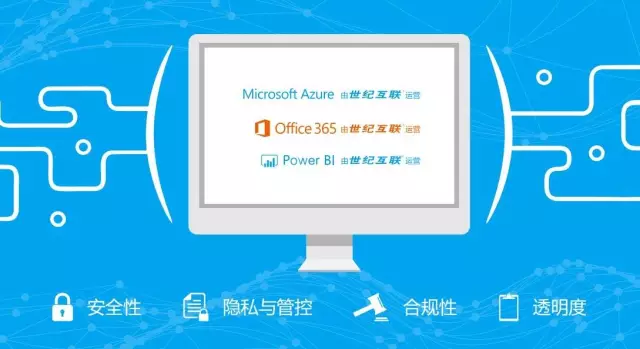
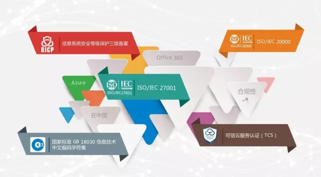

   

      

         

             <h1 style="font-size:24px; text-align:center;"><strong>微软携手世纪互联 可信云成功植根中国三周年</strong></h1>
             
本文是“微软可信云在中国”系列内容之一，由《信息安全研究》杂志社执行副主编崔传桢撰写，主要概括由世纪互联运营的微软云计算服务核心价值，为中国客户提供更安全可信的云服务体验。

			 
日月轮回，斗转星移，三年前微软携手世纪互联奏响了“可信云”进军中国云市场的号角，三年里两家公司的强强联合让“可信云”成功扎根中国，在中国市场上越来越强，在梦想的路上走的越来越远。

			 
			 
当前，中国正实施网络强国、互联网+战略、大数据等国家战略，云计算应用也在不断走向成熟，中国云服务产业正全面爆发进入高增长阶段，步入重体验、重应用时代。云服务成为各个行业领域的基础技术，时下火热的大数据、人工智能等新兴领域，都离不开云计算支持。

			 
			 
2015年，习近平主席在致国际教育信息化大会的贺信中说：当今世界，科技进步日新月异，互联网、云计算、大数据等现代信息技术深刻改变着人类的思维、生产、生活、学习方式，深刻展示了世界发展的前景。中国愿同世界各国一道，开拓更加广阔的国际交流合作平台，积极推动信息技术与教育融合创新发展。

			 
			 
<strong style="color:rgb(0,115,198)">首个落地中国的国际公有云品牌，联手世纪互联蓝云</strong>

             

			 
			 
基于对中国政府和中国市场的高度认可，微软公司决定加大对中国的投资合作。2012年，微软与世纪互联达成协议，将云技术和产品交付给世纪互联运营。2013年，由世纪互联运营Microsoft Azure和Office 365作为第一个进入中国的国际性公有云品牌，拉开了中国公有云服务市场的大幕。2014年由世纪互联运营的Microsoft Azure和Office 365服务投入商业运营， 2016年由世纪互联运营的Power BI服务登陆中国。

			 
微软公司的进入让中国的公有云服务进入了一个相对规范、标准而专业的发展与竞争轨道，引发了各界关注。<strong>微软提出的可信云四原则：安全性、隐私与管控、合规性和透明性，诠释了微软云计算服务的核心价值，逐步成为业界的事实标准和服务准则。</strong>微软云技术与国内其它简单以计算和存储为核心的IaaS云基础设施服务显著不同，依托微软自身强大软件生态系统包括Windows操作系统、Office应用软件和数据库的整合优势，为商业客户提供差异化的在线公有云服务。同时微软将借助其全球最大规模企业软件市场领导者的独特优势，为国内用户提供更全面完备服务体验。世纪互联为公有云的运营提供承载与运营保障服务，扬长避短战略协同，实现跨越式发展。

			 
<strong style="color:rgb(0,115,198)">过去三年时光，成绩斐然</strong>

			 
			 
2015年1月，《国务院关于促进云计算创新发展培育信息产业新业态的意见》发布：支持云计算企业通过海外并购、联合经营、在境外部署云计算数据中心和设立研发机构等方式，加强国内外企业的研发合作，引导外商按有关规定投资我国云计算相关产业。

			 
			 
正是严格遵循国家的规定和政策以及不断的努力，三年多以来，Microsoft  Azure和Office 365已发展成为中国云市场最重要的力量之一，微软和世纪互联的合作模式，也成为了中美云领域的典范，被诸多企业所借鉴，并以过硬的技术和服务，为近7万家企业用户解决了上万件棘手的问题，比如：招商证券、劳斯莱斯、神州数码、金蝶、文思海辉、孩思乐、海航、蒙牛、海尔、小米、乐视、凤凰网等，且获得<strong>公安部信息系统安全等级保护三级备案</strong>，并连续<strong>3</strong>年通过工信部主导的可信云服务认证。

			 
			 

			 
			 
<strong style="color:rgb(0,115,198)">世纪互联蓝云独家运营，为客户提供优质服务</strong>

			 
			 
2014年12月，中央网信办发布的《关于加强党政部门云计算服务网络安全管理的意见》提出，敏感数据不能出境，为党政部门提供服务的云计算服务平台、数据中心等要设在境内。同年两项云计算服务安全方面的国家标准——《云计算服务安全指南》和《云计算服务安全能力要求》发布，上述法规标准对公有云计算服务在国内的安全应用提供了指导。微软公司是全球云计算领域的领先企业，并且积极与中国企业合作，打造可信云计算生态环境、特别是创建了云计算服务本地化运营的模式。<strong>由世纪互联独立运营的Microsoft Azure,Office 365和Power BI，致力于为客户提供可信赖的云服务，保证客户数据始终位于中国境内、基础设施由中国本地公司运营。</strong>

			 
			 
<strong>目前真正意义上可以在中国进行商业化运营的国际公有云平台极少，而蓝云通过了政府的严格评议，成为中国第一个国际云计算平台。</strong>

			 
			 
Azure、Office 365和Power BI的业务由世纪互联全资子公司——上海蓝云网络科技有限公司独家来承载，负责完成所有的产品运营和服务工作，包括数据中心的管理、软件平台运维、客户技术和商务支持、合规咨询以及客户BOSS系统。中国政府出于信息安全的考虑，对于国际公有云落户中国有着严格要求。

			 
			 
由世纪互联运营的Microsoft Azure、Office 365和Power BI遵循微软全球统一标准的技术架构和运维规范，<strong>率先提供了有财务保障的SLA服务承诺，位于中国北部和东部的两个数据中心相距千里,实现提供多达6个数据备份，并有超过400人的技术团队确保7*24*365的全天候本土化服务。</strong>微软的销售团队会与IT技术专家一起，深入了解客户的应用场景和需求，从而有的放矢地为其提供最合适的技术、服务和解决方案。

			 
			 

			 
			 
从IDC到云计算的转变可谓顺势而为，再通过融合国际领先的云服务，世纪互联蓝云已经覆盖了从风火水电、基础设施、网络、IDC到云操作系统、云平台，再到前端、后端的运维服务等一系列解决方案。世纪互联蓝云事业部技术运维总经理汤涛认为，运维服务能力是公司与其他云计算厂商相比最大的优势所在。

			 
			 
区别于目前市场上的其他公有云，蓝云所提供的云服务最为全面，既提供IaaS和PaaS服务(Microsoft Azure)，也同时提供SaaS服务(Office 365和Power BI)。而其他公有云平台业务大多主要集中在IaaS和PaaS层面开发，以及相关的客户财务服务。<strong>由世纪互联运营的Microsoft Azure、Office 365和Power BI可承诺最高达99.99% 的服务可用性，Azure Storage达到业界最高的备份数量指标，可确保安全、可靠、灵活、高效的云服务，其表现成为业界服务标杆。</strong>

			 
			 
<strong style="color:rgb(0,115,198)">严格保护客户权益，获得客户信任</strong>

			 
			 
<strong>针对客户所关心的数据所有权和客户数据的安全性和隐私保护，世纪互联蓝云公司在协议中明确双方之间，除了公司授予许可的软件，保证客户数据不出境，确保客户对客户数据所有权和访问控制。公司只有系统上托管客户数据的权利，客户数据不会被挖掘，不涉及任何电子商务和广告业务，也不会被用于任何商业目的。</strong>

			 
			 
世纪互联蓝云积极学习遵循微软的高标准管理流程，例如数据隐私保护以最严苛的欧盟隐私保护要求（EU Model Clauses）和ISO 27018的部分条款要求自己，让很多大客户更加安心。三年来，公司以契约精神和完善专业的服务，赢得了客户的高度评价和信任。招商证券公司评价说：“在移动互联时代，Azure清晰的云战略可以更好地协助我们构建真正的企业云混合平台，最终选择Azure作为此项目的唯一云服务供应商”；神州数码公司评价说：“Azure是一个先进和可靠的公有云平台，北京神州数码BMS系统与Azure的组合让我们能够将新一代的IT技术快速带入到企业客户的日常业务中，为中国精益制造提供新的动力。”

			 
			 
<strong style="color:rgb(0,115,198)">三方协力，推进中国云计算生态发展</strong>

			 
			 

			 
			 
微软在公有云技术成功落地中国之后，也把合作的脚步迈向了更广阔云计算市场和生态环境。

			 
			 
2015年9月的第八届中美互联网论坛上，紫光股份、世纪互联和微软签署三方《战略合作备忘录》，紫光股份与世纪互联组建紫光互联科技有限公司。紫光互联将依托微软的混合云服务技术和解决方案，量身打造安全的、自主可控的、且具有世界领先技术水平的混合云解决方案及提供专属云服务。这是继世纪互联合作之后，微软在中国市场的进一步发力。

			 
			 
2016年7月，在微软全球合作伙伴大会（WPC2016）上，微软公司CEO萨提亚·纳德拉（Satya Nadella）、微软大中华区董事长兼CEO柯睿杰（Alain Crozier）、微软云产品事业部全球主管等，和紫光集团董事长赵伟国、联席总裁兼紫光互联董事长齐联等，一致表示高度重视所达成的战略合作伙伴关系，共同开发世界一流技术标准和安全性能有关产品，推出符合中国政府要求的安全、中立、先进的混合云产品及相关服务，成为美中两国务实合作、互利共赢的典范。

			 
			 
<strong style="color:rgb(0,115,198)">压力和前景：寡言少语的技术与服务领跑者</strong>

			 
			 

			 
			 
2015年，IDC、Forrester公布的相关调查报告中，可信云Azure均被评为中国公有云市场上的“领导者”。参照微软与世纪互联的合作模式，众多云计算国际巨头积极抢占中国市场，与国内服务商达成协议，由国内服务商运营其云服务，如：SAP与中国电信、甲骨文与腾讯云等，都是通过中外合作的模式实现落地。

			 
			 
微软中国秉承了微软低调和踏实的作风，在技术研发和客户服务上不遗余力，却对外少言寡语。尽管国内很多云服务同行高管出自世纪互联，业内也称之为“云人才的黄埔军校”，认可其公有云市场的领先地位，但我们接触的，无论是微软中国还是世纪互联蓝云，都是关注和探讨云技术及客户服务的改进，是坚定的计划执行者，其他方面少言寡语，不善言辞，但这并不影响业内认可它在技术和运维上的领跑地位。

			 
			 
当前的中国云市场，网络巨头纷纷加入，高手林立，共同角力未来同一块云金牌。但是，<strong>秉承安全性、隐私与管控、合规性和透明性四项原则的微软可信云计算服务竖立了业届标杆</strong>，就此而言，微软可信云在中国未来前景应该是美好的，因为它就属于那种技术与服务运维能力领跑，寡言少语但坚定的计划执行者。当然，冠军究竟花落谁家，最终还是由未来证明。

			 
			 
最后，我修改了John Bingham的一句话：奇迹也许不是我完成的，奇迹是我有勇气开始——这或许是符合当前微软可信云的心声吧。

			 
			 
</strong>评论：</strong>

			 
</strong>梦想与坚持：云计算的未来</strong>

			 
			 
</strong>崔传桢</strong>

			 
			 
走过11年后，云计算正成为全社会创新的基础设施，催生了各种新技术与商业模式，云计算在全球不断驱动技术与商业的变革。

			 
			 
当前的云市场已经进入用户应用与体验时代，迎来了高速增长期，中国云市场经诸雄混战，几大巨头格局已经初步形成，但是这并不意味着市场已经瓜分完毕，因为中国大量的中小企业上云才开始不久，新行业和市场不断涌现，更多的客户还会上云。例如，2016年最火爆的行业云集中在了体量大、上云需求强烈的游戏和视频、直播行业，下一步政务、金融、交通、制造、医疗等传统行业将会接棒，未来还有哪些新行业，同样难以预测。

			 
			 
公有云的赢利，更多还是来自于PaaS层，甚至是SaaS层的服务，这点从微软和AWS的发展轨迹可以得到证明。从长期角度说，云市场最后拼的是技术加运维，技术领域和运维都是忽悠不了的，没有过硬的技术持续和创新能力以及高标准的运维要求，即使你现在领先，早晚还是会被超越。无论传统还是现在，微软可信云的优势是显著的。

			 
			 
拥有梦想的人很多，但坚持梦想的人却不多。让我们坚持激情和追求，不要停止前进的脚步，共同期待未来十年云市场的精彩吧。

			 
			 
         

      

   

   

