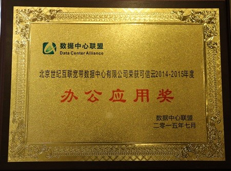

   

      

         

             <h1 style="font-size:24px; text-align:center;"><strong>打造世界一流本土可信云</strong></h1>
             <h1 style="font-size:24px; text-align:center;"><strong>世纪互联蓝云再获3项可信云服务认证和办公应用奖</strong></h1>
             
4月28日，由北京市公安局主办的第三届“4.29首都网络安全日”网络与信息安全博览会在北京展览馆举行。作为首个在国内商用的国际云计算服务——基于微软技术由世纪互联运营的 Microsoft Azure 和 Office 365 亮相博览会。微软和世纪互联蓝云在博览会上搭建了联合展台，向与会者展示了国际一流的云计算技术和安全可信的云计算运维和服务的成果，为业界提供了云安全的交流机会，助力推动网络安全与信息安全的发展。2015年7月31日，北京——世纪互联蓝云事业部今日宣布，在由数据中心联盟发起的第四批可信云服务认证评选中，世纪互联运营的 Office 365 在线应用服务荣获了企业级电子邮件、文件共享、联机会议3项可信云服务认证。在同期召开的2015可信云服务大会上，世纪互联运营的 Office 365 凭借为用户提供了卓越的生产力和高效协作的高端云服务应用，荣获了“可信云2014-2015年度行业云服务奖”的办公应用奖。此次奖项和认证的获得，进一步印证了由世纪互联运营的 Windows Azure 和 Office 365 云服务所拥有的业内一流可靠的技术、安全稳定的运维、以及完善规范的服务体系。 

             

             
世纪互联蓝云事业部总裁柯文达表示：“世纪互联蓝云一直以来非常重视云服务的可靠性和安全性建设。在2014年获得了3项可信云认证、2015年初获得了2项可信云服务认证之后，我们持续加强在可信云方面的建设。此次再次获得3项认证和办公应用奖，是我们在技术、运维、规范，以及团队建设等各个方面实力的综合体现。世纪互联蓝云将不断提升云服务的安全性、可靠性和稳定性，为中国用户打造有中国特色的世界一流本土可信云服务。”

             
世纪互联蓝云此次获得认证的3项云服务在稳定性（包括数据存储的持久性、故障恢复能力、服务资源调配能力）、安全性（包括数据私密性、数据知情权、数据可销毁性、服务可审查性）、服务能力（包括数据可迁移性、服务可用性、网络接入性能、服务计量准确性）等方面达到了认证规范要求。这代表了世纪互联运营的 Office 365 在打造安全、可靠的在线应用服务方面取得了卓越的成绩。如今，世纪互联运营的 Office 365 已成功服务了国内超过35000家用户，其中不乏对安全有很高要求的政府、金融等领域的用户，如：陕西政府、温州市政府、上海环境监测中心、中国银行、华龙证券等。用户的信赖，更加体现了世纪互联蓝云提供的云服务的安全、可靠和稳定。 

             

             
随着云计算的深入发展，国家和企业对云计算服务的安全和可靠性的重视程度在不断加深，可信云标准和规范也逐步趋向成熟和完善。作为该领域的领导者，世纪互联蓝云积累了丰富的经验，凭借业界领先的技术和运维能力，逐渐形成了具有蓝云特色的云计算技术体系，包括： IaaS、PaaS、SaaS 全平台覆盖；最强大的 PaaS 平台；全方位的灾备能力；高度弹性可扩展；唯一针对混合云的同构服务；全网负载均衡。

             
世纪互联蓝云事业部总裁柯文达表示：“随着云计算更加深入到人们的生产和生活，云安全的重要程度也随之不断提升。作为国内云服务的领导者，世纪互联蓝云将一如既往地发挥我们在技术和运维上的领先优势，为用户提供可见的、高标准的可信云服务，与行业分享我们在可信云建设方面的经验，引领并推动中国云计算产业向更加安全、可靠的阶段迈进。“

             
<strong>关于世纪互联蓝云</strong>

             
上海蓝云网络科技有限公司（暨世纪互联蓝云事业部，以下简称世纪互联蓝云）是世纪互联成立的全资子公司，专门运营基于微软技术的 Windows Azure 和 Office 365 云服务以及相关云应用解决方案。公司拥有一支近 400 人的具备国际一流服务保障水准的云计算运维团队，为客户提供包括 IaaS、PaaS、SaaS 在内的全方位云服务。作为国内领先的本土云服务提供商，世纪互联蓝云为广大用户提供了中国首家正式商用的国际云计算服务平台，并为用户提供国内最具安全保障和成熟的云计算服务。

             
世纪互联蓝云一直致力于推动中国云计算生态系统的成熟与繁荣。2015年4月，世纪互联蓝云率先引入了国际上应用成熟、并得到广泛认可的4款云应用解决方案，引领中国云计算行业进入了重体验、重应用的时代。这些云应用分别是：GigaTrust 智能权限管理解决方案、BitTitan 全方位一站式数据迁移平台、让协同更加便利的 AvePoint 解决方案、Gartner 企业终端备份类别调研获得最高评分的蓝云终端备份解决方案。随着中国云应用的深入，世纪互联蓝云还将不断推出更多国内外优秀的云计算解决方案，助力中国用户高效、安全、便利地应用云。

             
如需了解更多信息，请访问：<a target="_self" class="mscom-link" href="http://www.21vbluecloud.com">http://www.21vbluecloud.com </a>

             
<strong>媒体垂询：</strong> 

             
世纪互联蓝云事业部 

             
孟钊宇 

             
电话：8456 2121 

             
邮件：<a target="_self" class="mscom-link" href="mailto:meng.zhaoyu@oe.21vianet.com">meng.zhaoyu@oe.21vianet.com</a>

         

      

   

   

